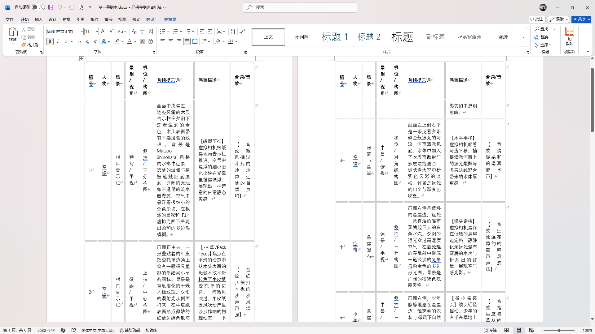
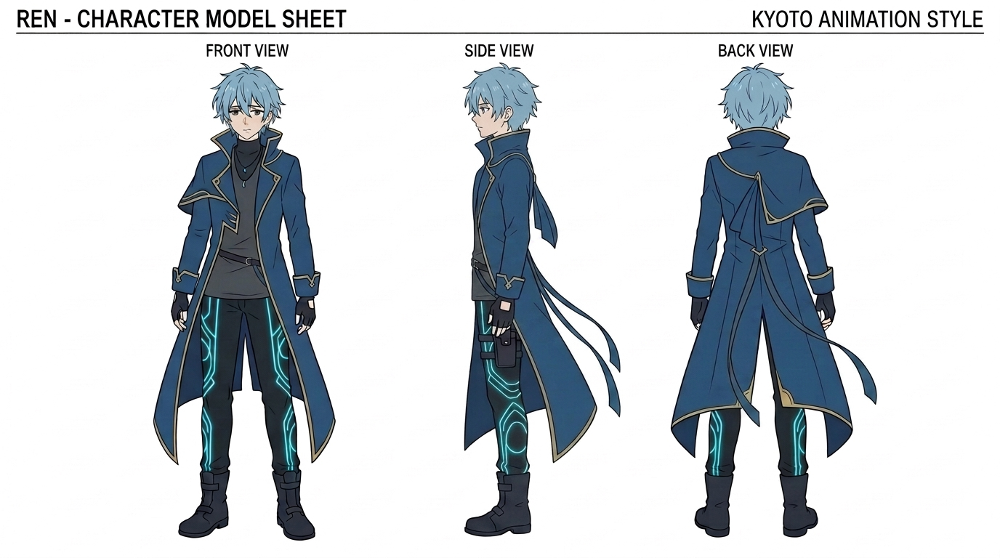
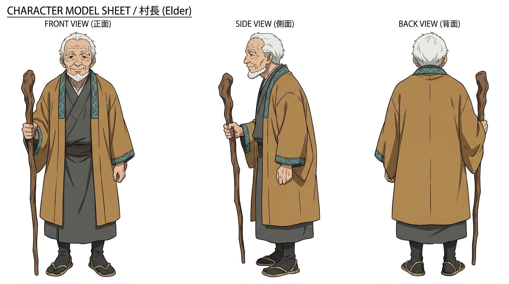
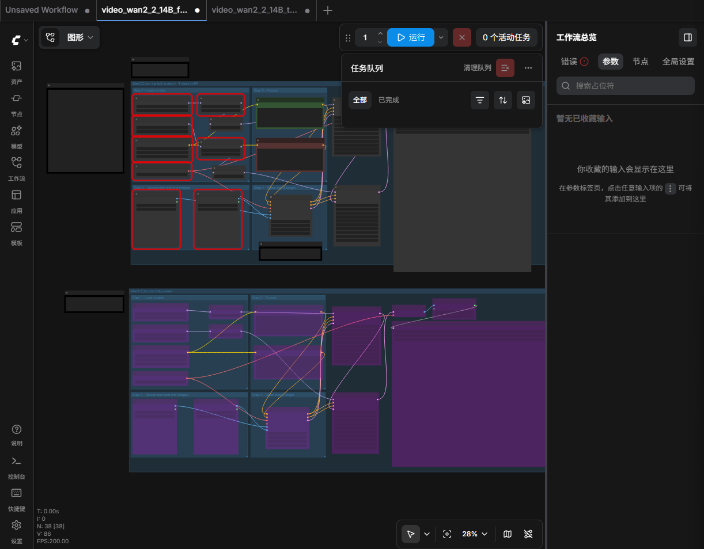

💡 导语：
网络舆论如黑潮般汹涌，现实的压力让人无处遁逃。如果在这个世界上，存在一个只属于你的“数字避难所”，它会是什么样子？本篇博客将首次公开我的媒介素养期末企划——独立动画短片《数字避难所》的美术概念与角色设定。

## 一、 概念起源：为何是“数字避难所”？

在信息爆炸与算法围剿的时代，个体常常感到赛博空间带来的窒息感。本部短片旨在探讨“媒介对人类精神空间的重塑”。短片中的“避难所”是一个主人公深爱着的游戏世界，他喜欢独自在这个世界探索，帮助这个有数字构建起来却具有温度的世界的居民们完成各样的委托。

### 从概念萌芽到框架的敲定
* **剧本创作**：由于在媒介素养课程中我属于游戏组成员，因此我自然想创造一个关于游戏主题的剧本，于是我马上想到了传统观念对于游戏的刻板印象，于是我决定创造一个“数字避难所”的概念。接着我将这一想法分享给了Gemini，并让其根据我的要去制定了一个剧本。
* **脚本编写**：然而仅有一个剧本是相当有限的，如果直接将剧本喂给ai，那么其产出的内容是相当具有不可控性，对于创作者来说，无异于大海捞针，因此我需要编写一个更细节，更精确的脚本，它会说明某一镜头中的主角是谁，站位如何，光线怎样，镜头的运动模式，声音的细节，甚至是镜头中的色彩倾向等等。为此，我请教了有ai动画创作经验的人，听取其建议为Gemini提供了十分严格的提示词，让其为我完成了脚本的制作，然后我再对其制作的进行修改，最终确定了脚本。

## 二、 角色美术设定（Character Model Sheets）

为了呈现出细腻的情感与诗意的日常感，本片在视觉风格上全面致敬京都动画（Kyoto Animation）的美学标签，追求通透的光影与微表情的捕捉。我使用 nona banana2 模型进行了多轮严格的提示词迭代，最终确立了两位核心主角的视觉形象：

### 1. 主角：REN（莲）
* **角色视觉**：175cm 留着一头清爽的淡蓝色短发，身穿深蓝色战术风衣，内搭黑色高领打底。
* **设计语言**：现代机能风的硬朗线条与忧郁的眼神形成对比，深蓝色风衣代表了他对外界的防御，而淡蓝色头发则象征着他内心深处对纯净、自由精神空间的向往。最终的人物设计帅气也而富有少年气质。

### 2. NPC（引路人）：村长
* **角色视觉**：饱经风霜的白发老者，身着传统的褐色和风长袍，手持一根斑驳的木质拐杖。
* **设计语言**：村长作为这个数字世界里的原生 NPC，他见证着这个少年从刚踏入这个世界的懵懂，到成为守护这片土地安宁与和谐的英雄。他的白发与斑驳拐杖，象征着岁月留下的沧桑与智慧。

## 三、 研发日志：从 ComfyUI 工作流到 40 秒的“流动静止”

一个好故事如何落地？本篇日志将记录我为了让这个世界“动起来”，在 ComfyUI 架构与 AIGC 视频模型中所做的技术尝试，并首次公开前 40 秒的珍贵动画片段。

### 1. 生产力的起点：ComfyUI 工作流搭建
为了实现高度可控的动画生成，我花费数天在 B 站深入学习工作流，在本地（或云端）搭建了一套包含文生图、图生图、文生视频及图生视频的复杂节点网络。

* **技术路径**：通过将上一阶段生成的关键帧（Keyframe）作为图像提示（Image Prompt）输入到下一阶段的视频节点中，试图在多模态模型中维持跨镜头的人物一致性（Consistency）与空间连续性。

### 2. 镜头拆解：被捕捉的 40 秒瞬间
以下为本片目前完成的 40 秒片段时的经过许多次的反复生成修改，消耗大量积分的一组镜头的文字内容：

#### 【镜头 1：暮光启幕】
* **提示词**：全景，画面中央偏右，饱经风霜的木质告示栏在夕阳下泛着温润的金色，木头表面带有干裂斑驳的纹理。背景是水彩中远景，远处的城堡与植被笔触细腻温润。
* **视觉呈现**：夕阳光线如流水般漫过，空气中悬浮着极细小的金色尘埃，在 F1.4 虚拟光圈下呈现出柔和的京都风多边形模糊。

#### 【镜头 2：场景深化】
* **提示词**：静景，清澈河面上的波光粼粼与多层法线混合带来的水体厚重感，远处瀑布蒸腾的水汽与折射出的虹晕。
* **环境音效**：远处瀑布隐约的轰鸣声

#### 【镜头 3：主角登场】
* **画面**：少年 REN 微微侧身，右手拔起一根细嫩的草茎，身体前倾。他双腿悬空，以非对称的频率轻轻前后晃动。

#### 【镜头 4：情绪宣泄与定格】
* **台词**：（疲惫的声线，音色参考松冈祯丞）“今天模拟考又砸了……回去又被我爸骂得狗血邻头。”
* **终景**：少年重新抬头迎着风，眼睛微微眨了一下。一滴因瀑布水汽凝结在睫毛末端的微小水珠在夕阳下折射出刺眼的光芒。
* **媒介表达**：随着最后一句台词——“……还好，只有这里的风，是真的舒服”，画面在一瞬间彻底【冷冻定格】，唯有睫毛末端的水珠闪烁，将情绪永远放逐在这一刻。

## 四、 那么最终短片的效果如何呢？

<iframe width="100%" height="468" src="//player.bilibili.com/player.html?bvid=BV1JsTQ6YEzG&p=1&autoplay=0" scrolling="no" border="0" frameborder="no" framespacing="0" allowfullscreen="true"></iframe>

## 五、 期末复盘：在“盲盒抽卡”中反思 AIGC 的技术神话与媒介局限

如果你看完了这个视频，自然说明我的动画短片创作并没有以“完美成片”的形式成功。耗费了无数个下午，在不断地“抽卡”与消耗可怜的模型积分后，我决定终止视频生成。然而，这次“未完成”的尝试，恰恰构成了我最深刻的媒介素养实践。

### 1. 声音的死寂与画面的割裂
在宏大的“AI 解放生产力”口号背后，是每一个个体创作者在面对多模态模型时的肉身挫败：
* **逻辑的断层与“不明所以”**：即使我在生成下一片段时提供了前一片段的关键帧作为参考，模型依然无法理解人类的“镜头视点切换”。从告示栏到瀑布，再到少年的动作，画面之间缺乏内在的逻辑流动，显得极其僵硬。
* **声音的机械窒息**：尽管我给出了明确的情感指导（“疲惫的声音”、“参考松冈祯丞”），AI 生成的音频依然暴露出严重的语调生硬、缺乏人类呼吸间细微的颤动与情感张力。同时，生成的片段中男孩的声音也不一致。

### 2. 理论反思：技术是“解放者”还是“新枷锁”？
* **“技术决定论”的反思**：我们常以为有了 ComfyUI、Luma、Wan2.2 这些强大的工具，人人都能成为新海诚或山田尚子。但实际操作中，创作者被禁锢在“抽卡机制（盲盒游戏）”中。我们不是在进行“自由的艺术创作”，而是在顺应模型的“统计学概率”，我们做的就是从那些生成的内容中做出选择。
* **数据的“平均化审美”对个性化表达的阉割**：京都动画（KyoAni）那种细小的“睫毛微小水珠折射”、“非对称的腿部晃动”，在人类动画师手里是灵魂的流露；但在 AI 看来，这只是一串难以拟合的低概率数据。AI 视频目前的流畅感，是以牺牲复杂的“微表情”和“镜头逻辑”为代价的，这些视频往往缺乏一些细节，而这些细节正是打动观众的东西。

## 六、 结语：转向博客 —— 我的最终媒介抵抗

由于时间限制和内容呈现的僵硬，我选择放弃完成 3 分钟的视频，转而用这个博客来承载我的所有设计。

视频动起来会僵硬，但在博客这个媒介里，静态的三视图、视频播放与文字的描述，反而给予了受众更多的“留白”与想象空间。这本身就是一种媒介素养的觉醒：不盲从于最新的视频技术媒介，而是选择最适合表达自己思想的媒介容器。

当然，我对ai短片的探索并未停止。我会接着尝试用更精细的提示词与技术手段，在未来某个时间点，或许能真正捕捉到我心中的“数字避难所”。